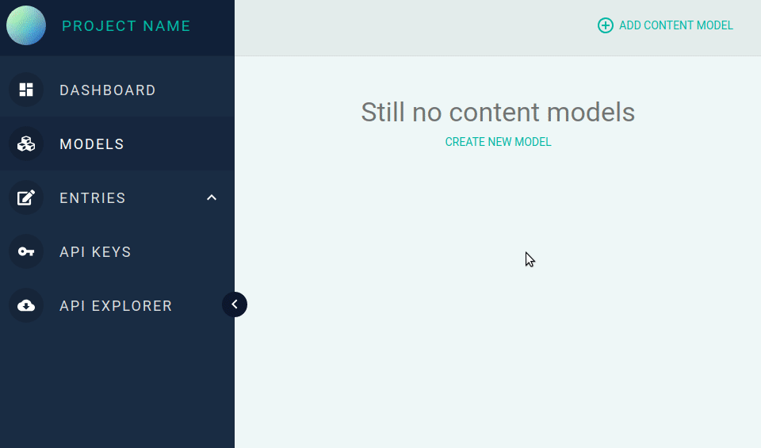
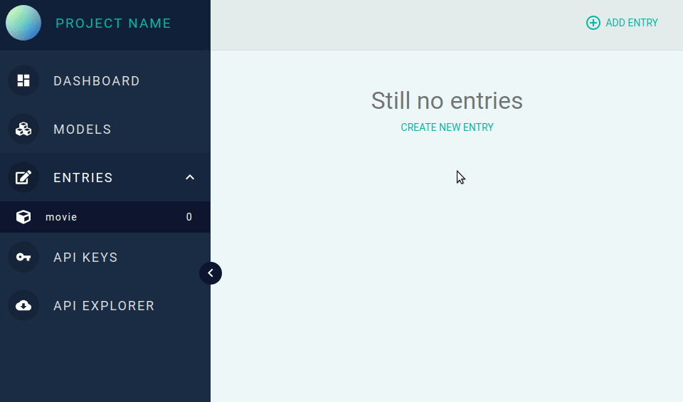
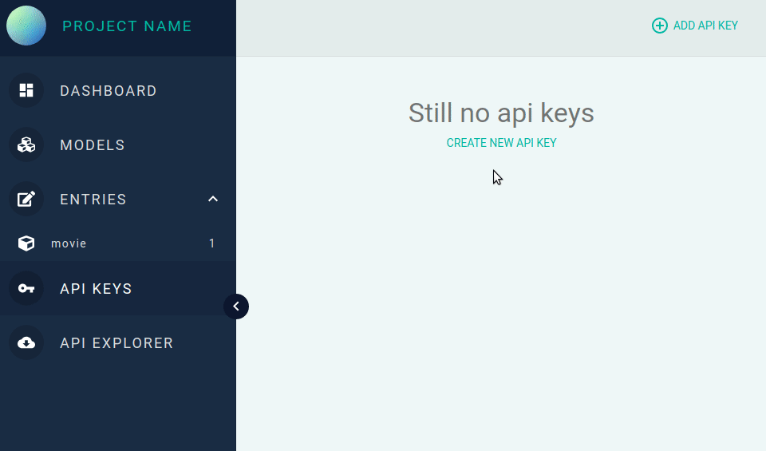

# [Any JSON CMS](http://anyjsoncms.com)

Open source headless CMS that could help manage and deliver any JSON to any app.

### Installation

Any JSON CMS consists of two parts. [Admin application server](https://github.com/evmizulin/cms-admin) and [API server](https://github.com/evmizulin/cms-api). To install Any JSON CMS you should install this parts separately.

### Basic usage

#### Create a model

Model is a schema which gives an answer: how does your content entry should look like?



#### Create an entry

Entry is content itself based on corresponding model.



#### Create an API Key

Any client requesting content from the API needs to provide an API Key.



#### Fetch your entries

Fetch your entries as a JSON and use them in any app.

```sh
curl https://api.anyjsoncms.com/entries -H "ApiKey: ad39d7bd70266cc0c178260e061a3f1b42ab329e"
```

You will get:
```sh
[
  {
    "id": "5ce9825f69593f074d954c60",
    "identificator": "Interstellar",
    "value": {
      "title": "Interstellar"
    },
    "modelId": "5ce980d369593f074d954c5f"
  }
]
```
